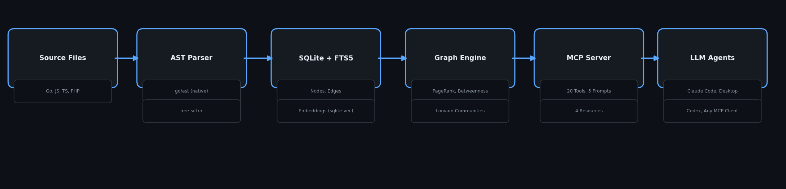
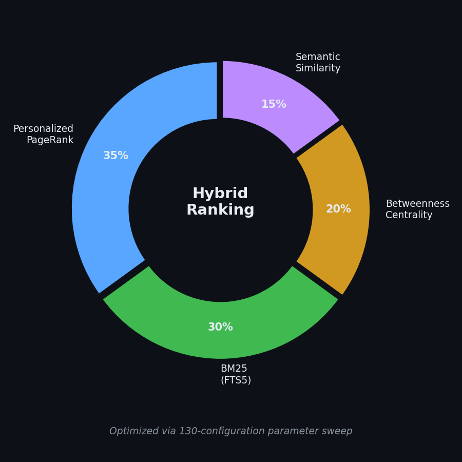
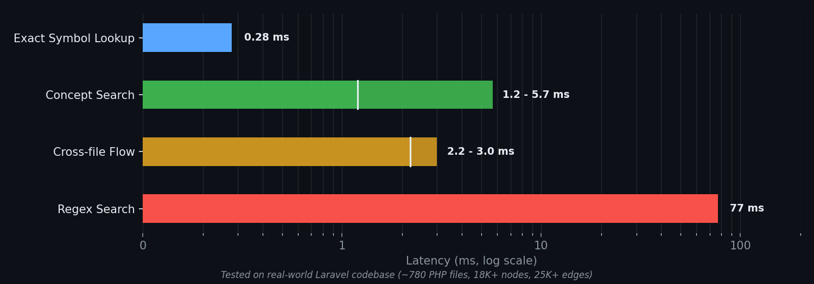
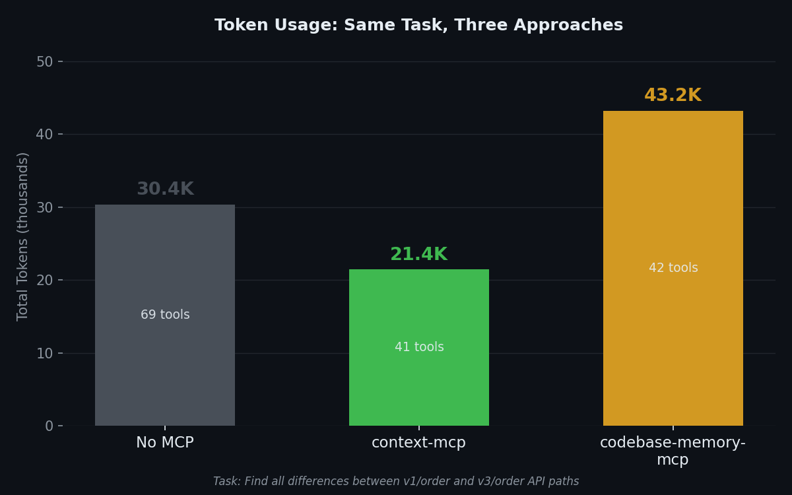

# context-mcp

A local-first MCP server that gives LLM coding agents surgical, token-efficient code retrieval through structural graph analysis and hybrid ranked search.

[](https://go.dev)
[](LICENSE)
[](https://github.com/maplenk/context-mcp/actions/workflows/ci.yml)

## The Problem

LLM coding agents waste thousands of tokens brute-forcing through grep and glob results with no structural understanding of the codebase. They read entire files hoping to find the right function, missing cross-file relationships entirely.

| | Without context-mcp | With context-mcp |
|---|---|---|
| **Discovery** | `grep -r "payment" . \| head -50` | `context {"query": "payment processing"}` |
| **Files read** | 12 files, ~4800 lines | 10 ranked symbols, ~47 lines |
| **Token cost** | ~9,600 tokens | ~940 tokens |
| **Structure** | No cross-file awareness | Callers, callees, blast radius |
| **Ranking** | Line match order | PPR + BM25 + Betweenness + Semantic |

## Features

- **Single binary, zero cloud dependencies** -- SQLite + FTS5 + sqlite-vec, runs entirely local
- **Hybrid ranked search** -- Personalized PageRank + BM25 + Betweenness Centrality + Semantic Similarity
- **20 MCP tools, 5 prompts, 4 resources** -- from symbol lookup to blast radius analysis to token-budgeted context assembly
- **Sub-120ms query latency** -- tested on real-world 18K+ node codebases
- **Multi-language** -- Go (native go/ast), JavaScript, TypeScript, PHP (tree-sitter)
- **Incremental indexing** -- filesystem watching with .gitignore-aware hot-reload

## Quick Start

```bash
git clone https://github.com/maplenk/context-mcp.git && cd context-mcp
go build -tags "fts5" -o context-mcp ./cmd/context-mcp

# Run as MCP server (connect Claude Code, Desktop, or Codex)
./context-mcp -repo /path/to/your/project

# Or query directly via CLI
./context-mcp -repo /path/to/your/project cli context '{"query": "authentication"}'
```

Prerequisites: Go 1.25+ with CGO enabled, a C compiler (gcc/clang).

## Direct Install

For release-based installs, use the checksum-resolved `server.json` asset attached to each tagged GitHub Release. The checked-in [`server.json`](server.json) file is the manifest template tracked in git and is resolved with the release checksum during publishing. The first packaged release target is macOS Apple Silicon (`darwin/arm64`) and installs the prebuilt `context-mcp` binary over stdio.

The client-specific commands below are the local-binary path. They assume `context-mcp` is already present on disk, whether you built it yourself or downloaded it from a release artifact.

## Connect to Your Agent

<details>
<summary><strong>Claude Code</strong></summary>

```bash
./context-mcp install --client claude-code --repo /absolute/path --profile extended
```

Or manual `.mcp.json`:

```json
{
  "mcpServers": {
    "context-mcp": {
      "command": "/absolute/path/to/context-mcp",
      "args": ["-repo", "/absolute/path/to/your/project", "-profile", "extended"]
    }
  }
}
```

</details>

<details>
<summary><strong>Claude Desktop</strong></summary>

macOS: `~/Library/Application Support/Claude/claude_desktop_config.json`

```json
{
  "mcpServers": {
    "context-mcp": {
      "command": "/absolute/path/to/context-mcp",
      "args": ["-repo", "/absolute/path/to/your/project"]
    }
  }
}
```

</details>

<details>
<summary><strong>Codex</strong></summary>

```bash
./context-mcp install --client codex --repo /absolute/path --profile extended
```

Or manual `~/.codex/config.toml`:

```toml
[mcp_servers.context-mcp]
command = "/absolute/path/to/context-mcp"
args = ["-repo", "/absolute/path/to/your/project", "-profile", "extended"]
```

</details>

<details>
<summary><strong>HTTP Transport</strong></summary>

```bash
./context-mcp -repo /path/to/project serve-http -port 8080
# Optional: -bearer-token dev-token
```

> **Note:** `install` / `print-config` helpers do not yet emit client-specific auth header configuration for HTTP bearer-token setups. Configure auth headers manually in your client config.

</details>

## How It Works



context-mcp walks your repository, parses every source file into an AST, and stores functions, classes, and their relationships as nodes and edges in a local SQLite database with FTS5 full-text indexing. It generates vector embeddings for semantic search, builds an in-memory directed graph for centrality and PageRank computation, and watches the filesystem to incrementally re-index changed files -- keeping the structural model up to date as you code.

## Search Ranking

```
score = 0.35 x Personalized PageRank
      + 0.30 x BM25 (FTS5)
      + 0.20 x Betweenness Centrality
      + 0.15 x Semantic Similarity
```



Weights optimized via 4-phase parameter sweep across ~130 configurations. FTS5 queries enhanced with CamelCase splitting, prefix matching, and stop word filtering.

## Performance



| Metric | Value |
|--------|-------|
| Exact symbol lookup | <1ms |
| Concept search | 1-6ms |
| Cross-file flow | 2-3ms |
| Regex search | <80ms |
| Index size tested | 18K+ nodes, 25K+ edges |
| Indexing time | 19s (780 PHP files) |
| PageRank (100 nodes) | 55us |

Full benchmark methodology in [benchmarks/](benchmarks/).

## Token Usage



Same real-world task ("find all differences between v1/order and v3/order API paths") run three ways on an 18K-node Laravel codebase:

| Approach | Total Tokens | Tool Calls | MCP Calls |
|----------|-------------|------------|-----------|
| No MCP | 30.4K | 69 (brute-force grep/read) | 0 |
| **context-mcp** | **21.4K** | **41** | **14** |
| codebase-memory-mcp | 43.3K | 42 | 11 |

context-mcp uses **30% fewer tokens** and **40% fewer tool calls** than no-MCP, and **2x fewer tokens** than the alternative MCP server -- while providing ranked, structural results instead of raw grep output.

Run your own benchmarks with `./benchmarks/run_mcp_usage.sh`.

## Tools

| Category | Tool | Description |
|----------|------|-------------|
| **Search & Discovery** | `context` | Hybrid ranked search combining lexical, semantic, and graph signals |
| | `search_code` | Regex search across indexed source files |
| | `explore` | Symbol search with optional dependency analysis |
| **Code Reading** | `read_symbol` | Safe-by-default source inspection — bounded, never dumps giant symbols. Supports signature, section, flow\_summary, full modes |
| | `list_file_symbols` | File symbol inventory in source order |
| **Impact & Architecture** | `impact` | Blast radius analysis with risk classification |
| | `trace_call_path` | Call path tracing between two symbols |
| | `understand` | Deep symbol analysis with callers, callees, PageRank |
| | `get_key_symbols` | Top symbols ranked by centrality |
| | `get_architecture_summary` | Community clusters, hubs, and entry points |
| **Change Tracking** | `detect_changes` | Changed symbols since a git ref |
| | `checkpoint_context` | Create named index checkpoint |
| | `read_delta` | Compare current state against checkpoint |
| | `assemble_context` | Token-budgeted context assembly |
| **Discovery & Proxy** | `discover_tools` | Bundle-driven tool activation for minimal profile |
| | `execute_tool` | Proxy for calling tools before activation |
| **System** | `query` | Read-only SQL against the structural database |
| | `index` | Trigger full or targeted re-index |
| | `health` | System health: uptime, node/edge counts, memory |
| | `retrieve_output` | Paginated retrieval of sandboxed oversized responses |

Also includes **5 prompt templates** (review\_changes, trace\_impact, prepare\_fix\_context, onboard\_repo, collect\_minimal\_context) and **4 resources** (repo\_summary, index\_stats, changed\_symbols, hot\_paths). Full parameter documentation in [USAGE.md](USAGE.md).

## Compact Output

Seven tools (`context`, `impact`, `understand`, `explore`, `detect_changes`, `get_architecture_summary`, `assemble_context`) accept a `compact: true` parameter that strips verbose fields (Reason, WhyNow, NextTool, NextArgs) from each result. This reduces output tokens by 50-70% for agents that only need IDs and scores.

```json
{"query": "payment processing", "compact": true}
```

## Output Sandbox

Responses exceeding 16 KB are automatically sandboxed: the agent receives a short preview with a `handle`, then calls `retrieve_output` to page through the full content in 4 KB chunks. Responses between 8-16 KB include a size warning. This prevents context window overflow from unexpectedly large results.

## Minimal Profile

Start with just 4 tools (`discover_tools`, `execute_tool`, `health`, `retrieve_output`) and activate more on demand:

| Profile | Active at startup | Can activate more? |
|---------|------------------|--------------------|
| `minimal` | `discover_tools`, `execute_tool`, `health`, `retrieve_output` | Yes, via `discover_tools` |
| `core` | 7 core analysis tools + `retrieve_output` | No dynamic discovery |
| `extended` | 14 tools + `retrieve_output` | No dynamic discovery |
| `full` | All 20 tools | Everything available |

`retrieve_output` is always registered in every profile as infrastructure for paginated retrieval of oversized responses.

Use `minimal` when your agent's context window is constrained or when startup tool-definition cost matters. The agent discovers and activates only the tool bundles it needs, reducing initial schema overhead by ~65% compared to `extended`.

```bash
./context-mcp -repo /path/to/project -profile minimal
```

The agent calls `discover_tools` with a task description, and the best-matching tool bundle is activated automatically. Four bundles are available: **inspection** (search/read/understand), **change_analysis** (impact/trace/detect), **architecture** (structure/modules/key symbols), and **assembly** (context/checkpoint/delta/search).

## Language Support

| Language | Parser | Coverage |
|----------|--------|----------|
| Go | Native `go/ast` | Functions, types, interfaces, methods, imports |
| JavaScript | tree-sitter | Functions, classes, imports, call edges |
| TypeScript | tree-sitter | Interfaces, enums, type aliases, generics |
| PHP | tree-sitter | Classes, methods, routes, inheritance |

Python, Rust, and Java parsers are on the roadmap.

## Why context-mcp?

| | grep / glob | RAG Pipeline | context-mcp |
|---|---|---|---|
| **Structural awareness** | None | None | Full AST graph |
| **Cross-file relationships** | None | Chunk-based | Call edges, imports, implements |
| **Ranking** | Line match | Vector similarity | PPR + BM25 + Betweenness + Semantic |
| **Token efficiency** | Low (full files) | Medium (chunks) | High (bounded, budget-aware) |
| **Setup** | None | Cloud infra / API keys | Single binary, zero config |
| **Latency** | Fast | Network-dependent | <120ms locally |
| **Offline** | Yes | Usually no | Yes |

## Configuration

| Flag | Default | Description |
|------|---------|-------------|
| `-repo` | `.` | Repository root path |
| `-profile` | `core` | Tool profile: `minimal` (4), `core` (8), `extended` (15), `full` (20) |
| `-workers` | `4` | Parallel parsing workers |
| `-onnx-model` | (empty) | ONNX model directory for neural embeddings |
| `-embedding-dim` | `384` | Vector dimension (384 TF-IDF, 768 ONNX) |
| `-cold-start` | `true` | Git history intent enrichment |

Full configuration reference in [USAGE.md](USAGE.md).

## Development

```bash
go build -tags "fts5" ./...           # Build (FTS5 tag required)
go test -tags "fts5" -count=1 ./...   # Run tests
go vet -tags "fts5" ./...             # Static analysis
```

CI runs build, vet, and race-detector tests on every push. Weekly security scanning with govulncheck, gosec, and trivy.

## Roadmap

- Additional language parsers (Python, Rust, Java)
- Pure-Go SQLite to eliminate CGO requirement
- Semantic flow tracing for business concept queries
- Enhanced route extraction for multi-version APIs
- Betweenness sampling for large codebases (>50K nodes)

## License

MIT -- see [LICENSE](LICENSE).
